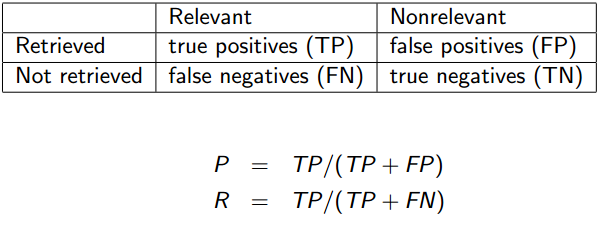
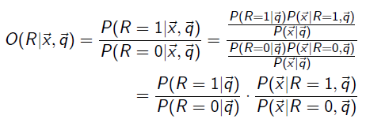
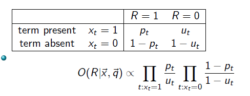
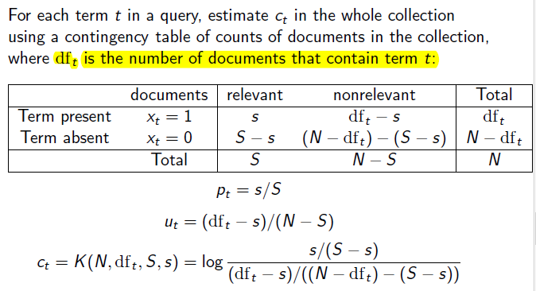

# Introduction ot Information_Retrieval

## IIR 1 Boolean Retrieval

**关键词**: 倒排索引 布尔模型

IR定义: 在非结构化材料中(文本)搜索满足信息需求的材料(文档)

**布尔模型**
- 查询是bool表达式
- 搜索引擎返回全部满足bool表达式的文档

**token&term关系**
- Word – A delimited string of characters as it appears in the text.
- Term – A “normalized” word (case, morphology, spelling etc); an equivalence class of words.
- Token – An instance of a word or term occurring in a document.
- Type – The same as a term in most cases: an equivalence class of tokens.

### 倒排索引

grep存在问题
- 慢
- grep是按行的, IR是面向文档的
- 否条件不好操作
- near这种条件无法实现

因此通过建立矩阵的方式:
1. 建立文档-词索引矩阵, 元素为1表示term在文档中出现, 因此对每个term有一个0/1向量.
2. 对查询中涉及到的词的向量做交集,对于not等条件取反, 就得到了结果.

**存在的问题**: 矩阵过于稀疏; **解决方法**: 邻接表表示, 每个termt, 保存一个链表, 链表中的元素是包含t的文档的编号.

倒排索引的构造:
- 收集需要索引的文档
- 对文本tokenize, 将文档转换为标识的列表
- 对token进行标准化得到用于索引的term
- 对term出现的文档进行索引, 产生一个倒排索引, 包含一个dictionary和对应的posting(文档编号的链表)

倒排索引中需要解决的问题:
- 如果对大集合构建索引:
- 需要多少空间存储dictionary和posting:
- 索引压缩:
- ranked retrieval, 如何获得最好的结果:

倒排索引用于查询的步骤: 1.定位到dictionary中的term, 2. 拿到各个term的posting, 3. 取交集获得最终的结果.

*tips*: 实际操作中, 从长度最短的posting开始合并.即获取terms后按照频率升序排序

## IIR 2: The term vocabulary and postings lists

**关键词** 多语言 vocabulary of terms, 跳跃点, 短语解析

简单布尔检索的假设和问题
- 假设: 文档已知; 词组已知;
- 问题: 如何判断文档, 如何定义和处理文档集合中的term vocabulary

**倒排索引vs 正排索引**
- 正排索引是从文档角度来找其中的单词,表示每个文档(用文档ID标识)都含有哪些单词, 以及每个单词出现了多少次(词频)及其出现位置(相对于文档首部的偏移量),所以每次搜索都是遍历所有文章.
- 倒排索引是从单词角度找文档, 标识每个单词分别在那些文档中出现(文档ID), 以及在各自的文档中每个单词分别出现了多少次(词频)及其出现位置(相对于该文档首部的偏移量).

## IIR: Index Construction

**关键词**:RCV1, BSBI, SPIMI, 分布式索引, 动态索引

RCV1: 1995-1996英文新闻文章数据集

### BSBI Blocked Sort-Based Indexing

---
BSBIndexConstruction()

1 n ← 0

2 while (all documents have not been processed)

3 do n ← n + 1

4 block ← ParseNextBlock()

5 BSBI-Invert(block)

6 WriteBlockToDisk(block, fn)

7 MergeBlocks(f1, . . . , fn; $f_{merged}$)

---

关键: block的尺寸

### SPIMI Single-pass in-memory indexing

## IRR 5: Index Compression

预处理中的一些步骤可以看做有损压缩: 小写化,停用词, porter, number elimination

Heaps' Law: 词典大小与token数量的关系

Zipf's law: 高频词在文档集合中出现的频率关系.

### 词典压缩
- 定长元素(20bytes-term, 4bytes-freq, 4bytes-pointer_to_posting)不好, term字长浪费同时不能表示所有单词.
- 将词典的terms连成一个string, 词典的每一项引出一个指针指向string中位置表示term, 同时增加length.
- front coding, 将不同词的相同前缀只进行一次表示,在之后用特殊符号代替

### posting压缩
- 基本的想法是一个posting是一个docID, 可以用整型或更小范围的正整数表示.
- 使用ID之间的gap表示, 可以使得数值更小
- 变长编码: 对于gap小于128, 低7位编码, 第一位设为1; gap大于128, 例如511(1 1111 1111), 从从高位开始排, 即 0,0000011 1,1111111
- Gamma code 对gap编码

## IIR 6: Scoring, Term Weighting, The Vector Space Model

布尔搜索存在问题: 用户不友好, 查找结果可能过少, 查询语句敏感

Jaccard系数: JACCARD(A,B)=$\frac{|A\bigcap B|}{|A \bigcup B|}$, 当查询和文档的中的term重复的多时, 系数值更高.J(A,A)=1, J(A,B)=0 当A,B没有共同的term

存在问题: 没有考虑term的频率, 出现概率小的词有更多信息

词袋模型: 不考虑词出现的位置, 但统计词在文档出现的次数. term frequency(tf) 表示词t在d中出现的次数. 但相关性并不会和出现次数成正比. 

log freq weighting: 由于非正比关系, 可以用log表示, $w_{t,d}=1+log_10 tf_{t,d}$, 文档的得分是所有出现在q和d中的term的权重之和.

df:文档集合中出现term的文档数量.

idf文档频率: $idf_t=log_10 \frac{N}{df_t}$, 描述term的信息程度.

idf对文档排名的影响仅当查询超过2个term的时候, 此时稀有词的权重会增加.

collection freq vs document freq: df更好, 更具有区分度.

tf-idf weighting: $w_{t,d} = (1 + log tf_{t,d}) · log \frac{N}{df_t}$

特点:
- 随着在文档中出现次数的增加而提高
- 随着term在集合中的稀有程度提高

term freq vs document freq vs collection freq.

**向量空间**

引入tf-idf后, 矩阵从binary变为词袋模型的cnt变到现在的权重. 此时文档可以表示成|term|维实数向量. 同时, 查询也可以做成实数向量. 比较查询和文档之间的关系变为比较两个向量表示的点在高维空间之间的距离, 但是欧式距离来表示并不合理(p34), 取而代之可以使用夹角.

如果对向量二维正则化后, 它们的内积就是cos, 可以直接比较

## IIR 8: Evaluation & Result Summaries
 
关键词: 如何评价IR结果的用户满意度, 结果统计

### unranked set

精确率 P: 检索到的相关文档/检索到的文档

召回率 R: 检索到的相关文档/相关文档总数

正确率: (TP + TN)/(TP + FP + FN + TN)

为什么不能用正确率: 总返回N就能够在大多数查询上获得99.99%的正确率

- 使用precision/recall存在的困难: 标签获得成本高
- 提高召回率的方法: 返回更多文档, recall:non-decreasing; 当recall低时常常能获得较高的precision. 因此需要在两者之间做权衡.

F值:

当$\beta=1$或$\alpha=0.5$, 获得调和平均.

- 当$\beta < 1$时, 强调precision, 反之强调recall.
- 选择调和平均因为其是一个smooth minimum.

### ranked set
对已排名的集合, 可以按照top1, top2, top3的结果去计算P和R, 然后可以绘制除p-r曲线.

对PR曲线插值获得11点插值平均精确率对分析性能很有效.

### 评估数据集

如何保证人相关的评估能够公平稳定? kappa方法

### 结果概要
返回的查询结果, 如何给出每个结果的概要

如何计算概要: 静态&动态 -- 动态是查询相关的

## IIR 9: Relevance Feedback & Query Expansion

关键词: 相关反馈 查询拓展; 解决问题: 如何提高召回率

### 相关反馈

质心: 文档的向量所表示的在高维空间中的点的中心.

**Roccohio Algorithm**: 在向量空间模型中实现相关反馈

**查询拓展**

基于同义词词典对查询进行扩展, 是查询无关的. 相关反馈基于文档给出反馈, 而查询扩展常基于词或短语给出反馈.

查询拓展与相关反馈的关系: 相关反馈也是一种查询拓展, 都是添加term到查询中,相关反馈基于查询结果列表中的"local"信息, 而查询拓展基于给定的近义词表的"global"信息.

## IIR 11: Probabilistic Information Retrieval

IR中的概率模型
- 系统对用户查询具有不确定性的理解
- 系统对文档是否符合查询进行具有不确定性的猜测
- 向量空间模型中更加相似的文档更加相关, 这并不直观和总是成立
- 概率论能够提供更加直观和清晰的模型描述相关的概率

**PRP原则:** 如果解锁得到的文档按照相关的概率倒叙排序,系统的效率将会是最高的(基本假设: 文档的相关性相互独立)

**BIM模型(Binary Independence Model)**
- 文档和查询表示成term的二值向量
- term之间相互独立(朴素贝叶斯中的朴素假设, 不成立但是可用)

模型中的bayes准则

- 其中$P(\vec{x}|R=1, \vec{q})$和$P(\vec{x}|R=0, \vec{q})$表示如果对于查询q,一个相关或不相关的文档被检索, 该文档是x的概率. 这个概率可用通过对整个集合进行统计获得.
- $P(R=1|\vec{q})$,$P(R=0|\vec{q})$是先验概率, 可用相关文档在整个集合中的百分比来估计.

可以通过对上式做比获得更加简单的表示, 

其中$\frac{P(R=1|\vec{q})}{P(R=0|\vec{q})}$对于给定q是一个定值, 可以忽略.

对$\frac{P(\vec{x}|R=1, \vec{q})}{P(\vec{x}|R=0, \vec{q})}$可以展开成
$$\frac{P(\vec{x}|R=1, \vec{q})}{P(\vec{x}|R=0, \vec{q})} \varpropto \prod_{t:x_t=1} \frac{P(x_t=1|R=1, \vec{q})}{P(x_t=1|R=0, \vec{q})} \prod_{t:x_t=0} \frac{P(x_t=0|R=1, \vec{q})}{P(x_t=0|R=0, \vec{q})}$$

上式整理并令$p_t=P(x_t=1|R=1, \vec{q})$, $u_t=P(x_t=1|R=0, \vec{q})$, 可以得到下式

另外的化简假设: 如果$q_t=0$, 则$p_t=u_t$(一个term没有出现在查询中,则它等概率的出现在相关和不相关文档中)

$$\frac{P(\vec{x}|R=1, \vec{q})}{P(\vec{x}|R=0, \vec{q})} \varpropto \prod_{t:x_t=q_t=1} \frac{p_t}{u_t} \prod_{t:x_t=0, q_t=1} \frac{1-p_t}{1-u_t}$$

继续化简, 将$x_t=1$和$x_t=0$两种情况合并, 有
$$\frac{P(\vec{x}|R=1, \vec{q})}{P(\vec{x}|R=0, \vec{q})} \varpropto \prod_{t:x_t=q_t=1} \frac{p_t(1-u_t)}{u_t(1-p_t)} \prod_{t:q_t=1} \frac{1-p_t}{1-u_t} \varpropto \frac{p_t(1-u_t)}{u_t(1-p_t)}$$

后一项对于给定的q是个常数可以忽略, 最后将累乘改为累加 ,取log, 就是检索状态值(RSV_d)
$$RSV_d=\sum_{t:x_t=q_t=1} log \frac{p_t(1-u_t)}{u_t(1-p_t)}$$

等价: 用查询中的terms的c_t, 即log odds ratios对文档进行排名
$$c_t=log \frac{p_t}{(1-p_t)} - log \frac{u_t}{(1-u_t)}$$

当c_t为正时, 表示更高的概率出现在相关文档, 当c_t为负时, 表示更高的概率出现在不相关文档.
此时, 文档的得分可写成$RSV_d = \sum_{x_t=q_t=1} c_t$

因此从操作层面上都可以使用倒排索引等计算向量空间模型和二值概率模型

进一步简化, 假设相关文档只占集合的很小比例, 则有以下化简
$$log \frac{(1-u_t)}{u_t} = log \frac{N-df_t}{df_t} \approx log \frac{N}{df_t}$$
**这和idf等价.**

对于自治的检索系统, 没有相关性判断的数据集可用, 这种情况, 可令$p_t=0.5$, 依靠log N/df_t得到c_t进行排序, 对于短文本同样可用工作.

### Okapi BM25
文档长度, 词频相关的BIM改进模型.

## IIR 12: Language Models for IR

统计语言模型