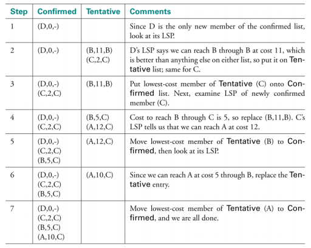
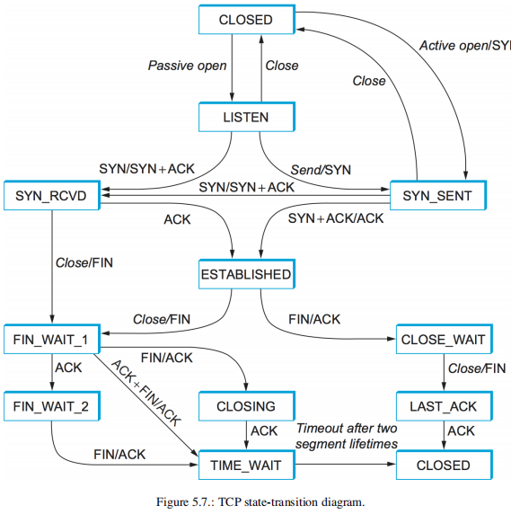
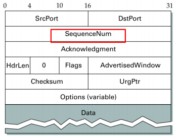

# 计算机网络
- [ch01-计网体系结构](#ch01-%e8%ae%a1%e7%bd%91%e4%bd%93%e7%b3%bb%e7%bb%93%e6%9e%84)
  - [网络基本概念](#%e7%bd%91%e7%bb%9c%e5%9f%ba%e6%9c%ac%e6%a6%82%e5%bf%b5)
  - [性能参数[带宽 &amp; 时延]](#%e6%80%a7%e8%83%bd%e5%8f%82%e6%95%b0%e5%b8%a6%e5%ae%bd-amp-%e6%97%b6%e5%bb%b6)
  - [习题:](#%e4%b9%a0%e9%a2%98)
- [ch1-2 直连网络技术](#ch1-2-%e7%9b%b4%e8%bf%9e%e7%bd%91%e7%bb%9c%e6%8a%80%e6%9c%af)
  - [调制, 编码, 成帧](#%e8%b0%83%e5%88%b6-%e7%bc%96%e7%a0%81-%e6%88%90%e5%b8%a7)
  - [信道共享技术](#%e4%bf%a1%e9%81%93%e5%85%b1%e4%ba%ab%e6%8a%80%e6%9c%af)
  - [差错控制技术](#%e5%b7%ae%e9%94%99%e6%8e%a7%e5%88%b6%e6%8a%80%e6%9c%af)
  - [习题](#%e4%b9%a0%e9%a2%98)
- [ch1-3 报文交换](#ch1-3-%e6%8a%a5%e6%96%87%e4%ba%a4%e6%8d%a2)
  - [以太网, 冲突域, 广播域](#%e4%bb%a5%e5%a4%aa%e7%bd%91-%e5%86%b2%e7%aa%81%e5%9f%9f-%e5%b9%bf%e6%92%ad%e5%9f%9f)
  - [虚拟局域网](#%e8%99%9a%e6%8b%9f%e5%b1%80%e5%9f%9f%e7%bd%91)
  - [*交换机生成树协议](#%e4%ba%a4%e6%8d%a2%e6%9c%ba%e7%94%9f%e6%88%90%e6%a0%91%e5%8d%8f%e8%ae%ae)
- [ch1-4 TCP/IP网络技术](#ch1-4-tcpip%e7%bd%91%e7%bb%9c%e6%8a%80%e6%9c%af)
  - [ICMP协议](#icmp%e5%8d%8f%e8%ae%ae)
  - [*路由算法: RIP, OSPF](#%e8%b7%af%e7%94%b1%e7%ae%97%e6%b3%95-rip-ospf)
  - [传输层](#%e4%bc%a0%e8%be%93%e5%b1%82)
  - [*组播: IGMP, PIM-SM, PIM-DM](#%e7%bb%84%e6%92%ad-igmp-pim-sm-pim-dm)
- [ch02-IPv6](#ch02-ipv6)
  - [IPv6报文结构](#ipv6%e6%8a%a5%e6%96%87%e7%bb%93%e6%9e%84)
  - [IPv6地址](#ipv6%e5%9c%b0%e5%9d%80)
- [ch-3 拥塞控制](#ch-3-%e6%8b%a5%e5%a1%9e%e6%8e%a7%e5%88%b6)
  - [拥塞控制基本概念](#%e6%8b%a5%e5%a1%9e%e6%8e%a7%e5%88%b6%e5%9f%ba%e6%9c%ac%e6%a6%82%e5%bf%b5)
  - [排队算法](#%e6%8e%92%e9%98%9f%e7%ae%97%e6%b3%95)
  - [流量整型](#%e6%b5%81%e9%87%8f%e6%95%b4%e5%9e%8b)
  - [TCP拥塞控制机制](#tcp%e6%8b%a5%e5%a1%9e%e6%8e%a7%e5%88%b6%e6%9c%ba%e5%88%b6)
  - [拥塞避免](#%e6%8b%a5%e5%a1%9e%e9%81%bf%e5%85%8d)
- [ch-4 P2P](#ch-4-p2p)
  - [三代p2p网络](#%e4%b8%89%e4%bb%a3p2p%e7%bd%91%e7%bb%9c)
  - [chord协议](#chord%e5%8d%8f%e8%ae%ae)
  - [区块链](#%e5%8c%ba%e5%9d%97%e9%93%be)

## ch01-计网体系结构

### 网络基本概念

计算机网络的需求:

- 连通性: 
  - 逻辑链路: 两点间通过通信协议的作用建立起的数据联结通路
  - 通路: 从源点到宿点所经过的一串节点和链路的有序集,或端到端的通路
  - 协议: 多个进程为完成一个任务而共同遵守的动作序列规范; 三要素:语法,语义,规则
- 为用户提供高效的资源分享
- 为开发者支持常用服务

网络体系结构
- 本质: 将复杂事物分解成元素和结构,结构描述元素之间的关系
- 元素: 协议 协议之间的关系: 分层
  - 协议定义服务接口--对上层的操作, p2p接口--和其他主机上的同层协议新信息交换
- 不同任务在不同层次, 同一层次可以有不同的抽象

OSI七层结构: 物理层, 链路层, 网络层, 运输层, 会话层, 表示层, 应用层

Internet结构
- 第一层: 中转网 backbone
- 第二层: 地区性网 Transit
- 第三层: 组织性网 Stub: 本地服务提供商

### 性能参数[带宽 & 时延]

带宽: Hz, KHz, MHz, bps
- 信号带宽: 频率范围, Hz
- 媒体带宽: 通信媒体允许通过的信号频带范围
- 通信链路: 比特率, 某时段内网络上可能传输的比特数, 习惯把带宽作为数字信道的数据率或比特率
- 比特率越高, 高频分量越多, 频率范围越大,信号带宽越高

吞吐率: bps
- 数字信号的发送速率, 发送带宽也称为吞吐率
- 与带宽的区别: 带宽是吞吐率的上限, 吞吐率是链路上实际每秒传输的比特数(测量性能)

延迟: 把一个报文从网络的一端传输到另一端所需的时间
- 延迟=处理+排队+传输+传播(主要考虑后两个)
- 处理时延: 检查包首部,决定导向何处, 比特差错检测,接受完整的一个分组的时间=包容量/链路速率
- 排队时延: 等待输出链路空闲
- 传输时延: 数量/带宽, 微秒到毫秒
- 传播时延: 距离/光速, 广域网中是毫秒级

传输/传播比较:
- 传输是将数据包从路由器发到链路上的时间
- 传播是数据包在链路上传播所需的时间

RTT: 发收来回那2次时延

端到端吞吐率计算:(**注意传输时间用RTT算**: 因为不仅包括单程时延,还包括了请求或建立连接的附加时间)
- 端到端吞吐率 = 实际传输大小/传输时间
- 传输时间 = RTT+传输大小/信道带宽
- RTT: 请求与回答的间隔时间

带宽和时延对于不同大小的对象和带宽的影响: 小数据时延迟支配带宽, 大数据时带宽支配延迟

延迟带宽积: 信道管道的体积,链路上所容纳的比特数

传输可靠性:
- 数据最小颗粒能正确到达
- 数据不同分片能有序到达

网络涉及者需要考虑的三个类型的故障
- 链路上的单比特错, 突发连续比特错
- 包错: 一个包在网络上丢失
- 节点链路级故障
QoS
- 连通性
- 吞吐量, 带宽 (记性参数)
- 延迟, 延迟抖动
- 丢包, 丢包率(乘性参数)
- 可靠性, 可用性 (乘性参数)

### 习题:

1. 一局域网最大距离为2KM，对于100Byte的数据包，在带宽为多少时，传播时延等于传输时延？512Byte的数据包呢？

    传播时延 = 2km / 3*10^8m/s = 0.667*10^-5s\
    传输时延 = 数据大小/带宽 = 100*8 / BW = 传播时延\
    BW = 120 Mbps\
    BW = 614.4 Mbps

2. 假设在地球和月球间建立一点对点100MPS的连接，地月距离为385,000KM，数据传播速度为光速（3*108M/S）
- A．计算最小的RTT
- B．use the RTT as the delay , calculate the delay*bandwidth product for the link
- C. 在B中计算的delay*bandwidth有何意义？
- D．在月球照的照片，并以数字格式存在磁盘上。如果地球上的控制中心想下载25M的最新的图形，那么从发出数据到传输完成所要的最小时间是多少
  
    A. RTT = 3.85*10^8 / 3*108 * 2 = 2.56 s\
    B. DBP = 1 * 10^8 * 2.56 = 0.32MB\
    C. 信道中存在的最大数据量\
    D. 25*8 / 100 + RTT = 2 +　２.56 = 4.56s

## ch1-2 直连网络技术

链路传输能力上限(香农定理): 传输能力和带宽B, 功率S, 平均信噪N存在关系$C=B log_2(1+\frac{S}{N})$, $dB=10*log_10(S/N)$

主干线路带宽: SONET 光网络
- SONET的帧决定了传输速率
- 同步光纤网通过分时来加快传输速率, 达到10G后引入分频的光波复用技术(单一信道的传输速率不超过10G)

### 调制, 编码, 成帧

信号调制: 修改信号的幅度, 频率和相位及其组合形式来标示和携带数据信息的过程

调制原因:
- 信噪比高, 传输能力大, 影响信号的噪声在不同的频率强度不完全相同
- 将原始信号移到噪声强度最低的频率,可以获得更高的传输能力, 调制使用的载波选择系统噪声强度最低的区域的频率

编码:
- 信号的物理层处理: 模拟->模拟(调制), 模拟->数字(编码), 数字->数字(编码), 数字->模拟(调制)
- bit的逻辑层编码: 4B/5B, 8B/10B, 64B/66B

比特率vs波特率:
- 比特率 bps=bit/s, 每秒传输的比特数
- 波特率 Buad, 每秒为表示某些比特而需要传输的信道单元数(码元数)
- 当仅当一个信号单元表示一个比特时,比特率等于波特率
- 通常一个码元--一个模拟信号波形可以表示多个bit

逻辑层编码(数字->数字): 信号中的连续0或连续1造成(1)信号平均值漂移(2)信号时钟不同步
- 基本NRZ: 0 低电平 1 高电平 (存在上述问题)
- NRZI: 1 电平变化 0 电平不变 (解决了连续1问题)
- Manchester编码: 0 低->高 1 高->低 (存在的问题, 信号传输率变成了两倍, 比特率是波特率的一半)
- 4B/5B: 将4bit映射到5bit, 使得头上不超过一个0, 结尾不超过2个0, 因此整个信号不会超过连续的3个0, 得到的再通过NRZI进行编码
- 差分曼码, 0位跳变, 之后0位或1位都会发生一次电平变化
- 8B/10B: 1G光传输
- 64B/66B: 10G光传输

以太网使用曼码, 差分曼码比曼码更容易检测,更适合高速传输, 两种码效率都只能达到50%左右, 而4B/5B+NRZI的效率是80%左右

成帧: 点到点链路间的一块有界数据,(有界是为了同步和共享)

帧: Frame 一个在具体网络第二层实现的,与硬件有关的特殊分组, 网上传输的最小单元, frame=数据部分+发送接收的**物理地址**+处理控制部分 [帧头 + 数据 + 帧尾]

成帧协议
- 面向字节(Byte)的协议: 
  - 面向字符终端, BISYNC, DDCMP, PPP/SLIP
- 面向比特(bit)协议:
  - 不关心字节的边界
  - 帧看做比特的集合
  - SDLC
- 如果body/payload中包含特殊字符(控制字符)
  - 字符转义, 加上一个转义符
  - 比特转义, 零比特插入
- SONET基于时钟的帧
  - 线路速率都是51.84Mbps的整数倍
  - 帧长度不依赖数据
  - 基本的SONET有无数据都是每秒8000帧, 每帧前三列作为系统管理信息,帧头开销3.3%
  - SONET的段开销的头两个字节也会出现在payload中, 但是不用做转义, 因为是固定长度的帧
  - STS的分时复用将时钟提高3倍, 让接收器仍然是每秒接受8000帧, 用多个复用的接收器(字节交叉的多路复用)
  - 帧前两个字节包含一个特定的比特模式,表示帧开始, 由于不进行比特插入, 可能出现在payload, 接收方希望它每810个字节出现一次

HDLC(面向bit的协议)
- 用01111110表示帧的开始和结束
- 任意时刻从消息体发出的5个连续的1后在发送下一个bit之前插入一个0
- 接收方: 如果5个连续的1到达, 如果下一个是0, 则去掉, 如果下一个是1, 查看下一个bit,如果是0,那么它是一个帧结束的标记;如果是1, 一定是出错, 丢弃整个帧, 接收方需要等到下一个01111110出现后才能再次开始接收

### 信道共享技术
复用: 把共享信道划分成多个子信道, 每个子信道传输一路数据

复用方法:
- 时分复用TDM
- 频分复用FDM
- 波分复用WDM 光纤
- 码分复用CDM 手机信号

### 差错控制技术
差错控制: 在通信中发现检测和纠正差错

为何要差错控制: 不存在理想信道->传输总会出错

产生差错的原因:
- 信号衰减和热噪声
- 信道的电气特性引起的信号幅度频率,相位的畸变
- 信号的反射和串扰
- 冲击噪声, 闪电, 大功率电器的启停

基本思想: 发方编码 收方检错 能纠就纠 不能则重传

基本方法: 收方差错检测, 并告知发送方是否正确接收

差错控制技术: 自动重传ARQ: 停等ARQ(发一等一, 重传刚才出错的帧), go-back-N ARQ(发送N等一个应答, 出错重传错起的所有帧), 选择重传ARQ(发N等一, 只重传出错的帧)

任何检测纠错的基本思想: 加入冗余信息到帧中, 一般为n位信息加入k<< n比特冗余

纠错码主要的编码方式: 奇偶校验 循环冗余校验CRC 校验和

### 习题

1. 1101 1110 1101 1011 1110 1110 1111, 4B/5B编码和对应的NRZI信号

4B/5B: 11011 11100 11011 10111 11100 11100 11101
NRZI: 01101 01000 10010 11010 10111 01000 10110 **[NRZI信号是画图]**

2. 0110 1011 1110 1010 0111 1111 0110 0111 1110 去bit插入, 找出问题
0110 1011 111 1010 **0111 1111 0**110 0111 1110
可能出现了比特传输错

3. (a) xxxDLExxx (b) 01111111

4. SONET (1) 1/(2*48*8) (2) 

## ch1-3 报文交换

### 以太网, 冲突域, 广播域
以太网基本思想:
- 原始以太网
  - 无连接, 先说后听, 想发就发, 错了重发
  - 对数据帧不编号, 不要求对方确认, 不可靠交付, 尽力而为
- 随机接入协议
  - CSMA: 先听后说+指数避退, 1-坚持, 非坚持, p-坚持
  - CSMA/CD: 多点接入, 载波监听, 碰撞检测
  - 信道效率: 传送距离越短, 发送帧时T0越长, 效率越高

网卡功能:
- 数据的封装和解封
- 链路管理: CSMA/CD
- bit的编码和解码

MAC(Media Access Control)地址:
- 单播帧地址
- 广播帧地址
- 多播帧地址
- 杂收模式:接受总线上所有的帧

高速以太网:
- Fast Ethernet 100Mbps, 只将比特时间从100ns缩短为10ns
- 1000Mbps, 不采用共享信道, 不使用CSMA/CD, 全双工, 使用双绞线时使用自动协商, 切换到半双工, 使用CSMA/CD, 8B/10B编码和NRZ
- 10Gbps 只支持全双工, 不支持自协商, 长距离物理层技术, 帧格式与之前完全相同

集线器: 物理层互联设备, 带宽受限, 广播风暴, 单工传输, 通信效率低

交换机: 链路层设备, 直接交换, 储存转发, 改进直接交换

广播域: 广播报文可以达到的范围

冲突域: 可以发生报文冲突的范围

交换以太网的每个端口处于独立冲突域, 不同端口的处于不同的冲突域, 但同一个广播域(同VLAN)*
### 虚拟局域网

虚拟局域网: 不依赖三层交换, 通过虚拟局域网VLAN, 可以将同一交换机或多个交换机的广播域划分成多个广播域
* 每个虚拟局域网是一个广播域

### *交换机生成树协议

网桥更新算法:
- 当一个新的分组到达端口时,
- 检查map中是否包含这个分组的src, 如果不在, 尝试将分组的src和分组进入的端口(interface)作为一个键值对写入到map当中, 如果在, 更新端口值, 并将TTL设为最大值
- 遍历所有的map表项, 将TTL减一, 对于TTL=0的项进行删除.

生成树协议(STP):

交换机根据配置消息更新它们自己的网络视图, 配置消息包括
- 发送消息的交换机标识符
- 发送交换机认定的根网桥的标识符
- 从发送交换机到根交换机的PathCost距离

概念:
- BPDU(Bridge Protocol Data Unit)
- 根交换机, 一个广播域内只有一个根交换机
- 根端口: 非根交换机选举根端口, 到根交换机距离最小的端口, 先按照距离选最小, 距离相等时, 比较上一跳的交换机优先级, 优先级相同时, 比较对端端口的优先级
- 指派端口: 连接两个交换机的一个link上有两个端口(属于不同交换机),有一个选为指派端口, 则link通过这个端口连接根, 规则也是到根交换机的距离最小, 距离相同时上一条标识符小的被选中
- 剩余端口为blocking状态
- 一个端口在STP中只有一个角色, 不可能是两个角色

**STP初始化:**
1. 当交换机打开的时候，所有的端口都处于Listening状态，每个交换机都会认为自己是根交换机（Root ID为自己），然后都每隔两秒就向外发送一次自己的BPDU。
2. 如果收到的BPDU的Bridge ID比自己的小，则停止转发自己的BPDU，开始转发更优BPDU,如果比自己的Bridge ID大或者和自己的Bridge ID相等，则丢弃该BPDU。
3. 持续15s（转发延迟）等到BPDU扩散完毕之后，开始各种端口的选举，这时候每个BID最小的交换机成了根交换机，各个交换机通过收到的BPDU来确定根端口和指定端口。剩下的成为非指定端口，转到blocking状态。然后进入learning状态
4. 进入Learning状态之后，填写MAC地址表，经过15s（转发延迟）之后进入Forwarding状态。
5. 进入Forwarding状态之后，开始转发数据，并且同时接受转发来自于根的BPDU（Root ID为根交换机），维护拓扑。这时只有根交换机发BPDU，其他交换机都只是转发BPDU。
6. 当一个新的交换机加入的时候，端口状态是Learning，新的交换机认为自己是根交换机开始发送BPDU，也接收对端的BPDU，然后进行进一步的竞选。
7. 若竞选成功，则网络拓扑就重新变化了，若竞选失败则计算根端口指定端口和非指定端口。（30s可以完成）

一个广播域内独立选举STP

距离也可以使用Path cost计算, 不同带宽的link具有不同的cost

**拓扑变化通知(TCN) BPDU**
1. 当一台交换机检测到拓扑变化后,它就可以发送TCN给root交换机,注意TCN是通过root port向root 交换机方向发出的.
2. 当交换机从它的designate port接收到TCN类BPDU时,它必须为其做转发,从它自已的root port上发送出去TCN类型的BPDU包,这样一级一级地传到root bridge后,TCN的任务才算完成.
3. 在以上的过程中,无论是哪台交换机从它的designate port上收到了TCN类型的BPDU包,它都必须给一个回复,必须从designate port上发出TCA位被置1的normal configuration BPD
4. 那么当TCN传遍全网,直至到达ROOT BRIDGE后,root bridge也要做出一种回应,它会发出一个正常的configuration BPDU包,当然会有一些不同,就是包内的TC字段会被置1,TC即topology change,表示发现拓扑变
化。
5. 这个包会被所有交换机转发,同样的TC位会置1,直至传遍全网,所有交换机都得知拓扑变化为止，原来转发表作废，重新开始选举

## ch1-4 TCP/IP网络技术
多个独立网络互联的问题
- 异构
- 可扩展

Internet可以看做由网络组成的网络, 网络之间互联通过internet protocol协议

### ICMP协议
ICMP报文
- 差错报文+控制报文+测试报文
- ICMP报文=头部+数据部分
- **被封装在IP数据包中进行传输**, 但不是IP的上层协议
- IP头中包类型=1, 仅用IP的转发功能

> ICMP 的内容是放在IP数据包的数据部分里来互相交流的。也就是，从ICMP的报文格式来说，ICMP 是IP 的上层协议。但是，正如RFC所记载的，ICMP 是分担了IP 的一部分功能。所以，被认为是与IP 同层的协议

ICMP应用: ping, traceroute

### *路由算法: RIP, OSPF
路由vs转发
- 转发过程: 接受一个分组, 查看它的目的地址, 查询转发表, 按表中决定的路径将分组转发出去
- 路由: 建立转发表的过程
- 转发表中的一行包括从网络号到发出接口的映射和一些MAC信息; 路由表作为建立转发表的前奏, 由路由算法建立一张表, 通常包含从网络号到下一跳的映射, 还包括如何得到这些信息的信息以便处理过时
- 路由表和转发表实际是否独立取决于实现, 但是构造转发表是为了优化转发分组时查找网络号的过程, 而优化路由表是为了计算拓扑结构的变化

自治域AS: 全球的所有AS组成Internet

内部网关协议IGP: 在一个AS内运行
- RIP适应小规模网络: 定时向邻居说, 说知道的所有(自路由表)
- OSPF适应较大规模网络: 变化时向所有人说(区内路由器组播) 只说邻居的事(链路状态)

外部网关协议EGP: 在AS之间运行
- 原因: Internet规模大, AS间直接OSPF收敛时间很长, AS间最佳路由不现实(cost意义不统一); AS管理策略不同
- BGP4: 只寻求一条能到达目的网络的较好路由(不循环), 并不是最佳
- BGP采用路径向量路由选择协议
- 变动触发BGP发言人(对接路由器)间交换彼此的路由信息

#### RIP (距离向量)
初始化算法:
- 每个节点把自己直接连接的节点的距离设为1, 自己不直接连接的节点的距离设为无穷
- 将自己的路由表发送给所有直接连接的邻居, 邻居根据收到的路由表, 将自己到该节点的cost与该节点发送的表相加后与自己当前的路由表进行比较, 如果有cost更小的到达某个节点的路径, 则更新自己的路由表
- 当拓扑结构不变化时, 通过节点与相邻节点之间交换少量信息即可得到完整的路由表, 算法收敛

更新算法:
- 定期更新, 定期的自动向邻居发送消息, 说明自己的正常运行
- 触发更新, 每当一个节点通知链路故障或从它的相邻节点收到导致路由表中路由发生改变的更新时, 引发的更新

存在的问题:
- 计数到无穷问题: 当一个节点失效时, 由存在多个和相邻节点连接的节点, 在一定的消息到达时序下, 到达的该点的距离不能立刻更新为无穷, 而会发生逐渐加1直到无穷的情况
- 解决方法: 设定较小的数值, 表示无穷, 例如超过16跳就认为是无穷了
- 解决方法: 水平分割, 只更新最新的消息, 如果传过来的距离虽然比当前的小, 但是比当前的旧则丢弃

#### OSPF(链路状态)
OSPF实现依靠两个机制: 链路信息的可靠传播, 根据所积累的链路状态知识的总和进行路由的计算

LSP(link-state packet)
- LSP包括的内容有产生lsp的路由器的ID, 与该节点直接连接的邻居节点以及到这些节点的链路cost的列表, 序列号, TTL
- 一个LSP采用洪泛的方式传递到当前域的所有路由器
- LSP产生的原因
  - 路由器定期产生, flooding会影响性能, 所以该周期会很长
  - 路由器定期向邻居发送hello报文, 探测邻居的可达性, 一旦发现拓扑变换, 就发出LSP
- LSP推动路由器重新计算OSPF路由
- LSP的传播: 两台邻接的路由器之间的LSP传送使用确认重传机制, 当节点收到一个LSP时, 检查路由器ID和序号,保存和替代旧的LSP, 之后将该LSP发送给刚才发送LSP的邻接节点以外的所有邻接节点;
- LSP的序号: 序号递增, 如果一个节点出现故障很长时间, 该节点的所有旧LSP都会超时, 那么它的序号从0开始; 否则节点最终会收到一份自己的带有更大需要的LSP副本, 然后它可以将序号加1并使用
- LSP的TTL: 一个节点收到LSP在扩散之前会将TTL减一, 同时它也使节点中存储的LSP"衰老", 当TTL等于0时, 再次扩散TTL为0的这个LSP,被网络解释为删除这个LSP信号

路由计算:

使用称为forward search的Dijkstra算法实现, 从收集的LSP计算路由表,每台交换机维护两张表:Tentative和Confirmed, 每张表里有多条记录, 每条记录包含(Destination, Cost, NextHop), 算法如下:
- 用我的节点中的一条记录初始化confirmed, 这条记录的开销为0
- 在前一步中加入confirmed的那个节点, 称为Next节点,选择它的LSP
- 对于Next节点的每个Neighbor节点, 计算到达节点的Cost, 也就是从我这个节点到Next节点再从Next节点到Neigbor节点的总开销之和
  - 如果Neighbor节点既不在confirmed, 也不在tentative, 将它作为记录加入Tentative, 其中nextHop就是我到达Next节点所经的节点
  - 如果Neighbor在Tentative,且开销小于当前等级的表中的开销, 那么用记录替换当前记录, 其中NextHop是我到达NextHop所经过的节点
- 如果Tentative为空, 算法结束, 否则从Tenative中选择cost最小的节点加入Confirmed, 并转回第2步

### 传输层
连接: (目的IP, 源IP, 目的端口, 源端口, TCP/UDP)五元组

互联网全部功能, 最基本, 最小粒度的服务: 端到端数据传输

#### UDP概念
最简单的传输层协议: 将IP协议上扩展成进程-进程的直接通信服务

UDP(User Datagram Protocol)
- 最小/简单分路协议
- 增加端口号和checksum
- 没有流控, 拥控, 可靠性和有序性
- 提供无连接服务, 不保证数据完整到达, 减轻网络通信负担
- 适应c/s模式的简单请求
- 应用程序自己实现超时重传等机制
- 可保留各报文间的边界, 不把应用多次发送的数据合并成一个包发出去, 且发包后不对该包缓存
- 组播应用, 音视频应用建立在UDP

#### TCP概念
TCP:
- 提供可靠, 面向连接, 按序到达字节流的服务, 全双工
- 流控机制: 允许每个字节流的接收端在给定时间内限制发送端的发送速率
- 支持多路输出机制
- 提供拥塞控制机制

流控vs拥控:
- 流控: 防止发送超过接受者能力, 端到端的发送
- 拥控: 防止过多数据注入网络中,引起交换机或链路超载, 关于主机到网络的发送

TCP连接建立与拆除:
- 三次握手建立连接: syn -> ack+syn -> ack
- 四次握手拆除连接: fin -> ack -> fin -> ack

TCP的状态转换:

TCP滑动窗口约束:

接收方: 

LastByteRcvd - LastByteRead <= MaxRcvBuffer\
AdvertisedWindow = MaxRcvBuffer - ((NextByteExpected-1)-LastByteRead)\
发送方:

LastByteSend - LastByteAcked <= AdvertisedWindow\
EffectiveWindow = AdvertisedWindow - (LastByteSent-LastByteAcked)

其中EffectiveWindow也就是流控所允许的还能发送的数据的窗口大小

TCP报文段的结构:

TCP在高速网络遇到的问题:
- 序列号回绕问题
- 发送窗口太小问题
- 增加32位的时标和32位的序号共同构成判断报文段到达先后的依据
- 选项中增加一个扩展因子项, 将advertiseWindow左移一定位数

### *组播: IGMP, PIM-SM, PIM-DM

组播的组成部分: 组播地址, 组成员机制, 组播路由协议

组播地址:
- IPv4: IPv4上组播地址是D类地址, 224.0.0.0-239.255.255.255, 不能聚合每个IP独立分配和使用
- MAC: 01:00:5E:00:00:00 - 01:00:5E:7F:FF:FF分配给组播使用, 将28位的IP组播地址空间映射到23位MAC地址的方法是将组播地址中低23位放置到MAC地址中23位
- IPv6: FF00::/10开头, 高8位固定为FF, 4位flag位(临时/永久等), 4位洪泛范围位(2为链路本地范围, E为全局范围)

组成员确定方式:
- 查询:的路由器定期向网络查询, 若有应答, 转发流量到该子网, 否则停止转发
- 报告:主动想路由器请求加入某个组, 退出时页发送退出消息

IGMP: 主机通过IGMP协议通知本地路由器希望加入并接收特定组播组的信息; 路由器通过IGMP协议周期性查询局域网内某个已知组的成员是否处于活动状态; 组播路由器通过IGMP构建组播转发表, 包含路由器各个接口以及在接口所对应的子网上有哪些组的成员

IGMPv1没有离开报告机制, IGMPv2有; 当子网中的主机收到别的主体的对相同组播组的成员关系报告后, 就抑制了自己的发送,减少流量.

IGMP querier
- IGMPv2为了改善性能，会从网络的多台路由器中选举出唯一的一台路由器来查询组成员（IGMP查询器）
- 只要IGMP查询器查询一次，所有路由器都能得到相同的结果
- 网络中拥有最低IP地址的路由器将被选举为IGMP查询器

组播协议总体结构:
- 路由器, 主机之间: IGMP
- 路由器, 路由器之间: PIM
- 路由器交换机之间: CGMP

PIM: 
- 要让路由器能像转发单播数据一样将组播数据精确的转发到目的地; 要生成一张组播路由表,让组播源和目的之间的路由表生成单播表一样的组播表
- 组播转发树--组播发送者和接受者之间的转发线路, 发送者是root, 接收者是叶子节点, 路由器在组播树上, 提供转发
- 防止组播反向路径转发: RPF(Reverse Path Forwarding), 组播路由表记住接收者接口和发送者接口, 朝发送者方向的接口称为RPF接口, 只有从RPF接口来的数据才会被转发

PIM-DM(密集模式):

- 组播源会向所有PIM邻居发出查询, 查询数据包中包含组的地址, 下一跳PIM邻居的路由器还会继续向它的邻居发出查询数据包, 这些数据包洪泛式的在PIM邻居之间传递.
- 如果路由器收到组成源的报告后, 会向自己RPF接口方向的邻居发送加入组的消息,宣布自己接收
- PIM-DM中记录组播路由的方式称为(S,G),S-组播源地址, G-组地址, 组播的出口标为forwarding, 不需要接收组播的PIM接口标为pruning
- (S,G)路由记录方式, 会因为组源地址的增加, 增加条目
- (S,G)记录的组播树被称为SPT(最短路径树), SPT中记录了组播发送者的源地址, 所以称为源树

DM组播路由表的一项表示如下:

PIM-SM(稀疏模式):

- SM模式在建立组播树时,并不会让路由器发送查询数据包去查询组成员, 而组成员的发现靠组成员自己主动想路由器发送报告
- 路由器从接口收到组成员的报告后,会向自己的上一跳邻居发送加入消息, 以通告自己需要接收, 如果上一跳邻居还不是组播发送者, 上一跳邻居会继续向上一跳发送加入消息, 直到组播源收到加入消息为止

## ch02-IPv6
IPv4存在的问题:
- 地址分配不合理(A, B, C类地址差距悬殊)
- CIDR推出晚, 效果有限[CIDR: 网络号划分]
- 路由表项爆炸
- 头长度不固定, 不利于ASIC处理;没有利用包前后的相关性, 每个包进行相同的处理; MTU导致分段和逐段校验, 路由处理慢
- 无法提供多样的QoS
- 地址限制问题
- 安全支持: 源地址伪造,报文明文, TCP劫持

IPV6主要特征:
- 扩大地址空间, 路由更结构层次化
  - 128bit, 全局unicast=公开地址, 全局CIDR
- 报头格式简化, 长度固定, 方便硬件处理, 引入结构化扩展报头
- 网络管理简化: 自动发现和自动配置, 最大单元发现(MTU), 邻接节点发现, 路由通告, 路由请求, 节点自动配置
- 安全性支持: IPSec, 认证头(AH), 安全荷载封装(ESP)
- QoS能力: 使用流标号
- 多播寻址: 允许区分永久性多播地址和临时性多播地址
- 可移动性

### IPv6报文结构

主要改变:
- 对齐: 32bit整数倍->64bit整数倍
- 取消报头长度字段, 固定报头长度40Bytes
- Total length -> Payload Length
- 源地址字段增加到每个字段16bytes
- 分片信息移到扩展报头中
- 生存时间TTL改名为Hop limit
- 业务类型改为数据流标号flow label字段
- 协议字段改为下一个报头字段, 以指明下一个报头类型

通信类别(TrafficClass)与流标号(FlowLabel): 都与QoS有关; 通信类别由应用层填充, 上层协议不能假定心愿填充的值不变, 宿端收到的值可能与源端不一样; 数据流标号支持资源预定

NextHeader代替IP选项和Protocol字段, 当没有特殊首部时,该位置填写TCP或UDP

扩展报头: 选项功能放在了扩展报头, 中间路由器除了逐跳扩展(Hop-By-Hop Options)和源路由选择扩展(Routing), 都不处理
- 逐跳扩展主要是巨型荷载选项, 报文长度最长达4G

### IPv6地址

地址模式
- 地址分配到接口: 单个接口可能分配有任何单播, 任播, 组播地址
- 地址有范围之分
  - Link local: 必须配置, fe开头, 访问同一局域网内IP
  - Site Local: 相当于IPv4的私有地址, 不被全局路由, 后被取消
  - Global
- 地址有寿命: 有效/永久, 临时地址用于访问别人(隐私策略, 快速老化自动分配)
- 地址结构: 前缀+接口ID
- 地址类型: 
  - Unicast: 目的地址指明的单一的计算机
  - Anycast(one to nearest): 目的地址是共享一个IP地址的计算机接口集合, 典型的情况是在不同物理网络上的不同节点, 发送到anycast地址的包将选择这个集合中路由度量距离最近的节点
  - Multicast: 目的地址是一组计算机,典型情况是属于不同网络的不同节点, 代替广播
  - Reserved  

*注: 广播由组播代替.*

|前缀|用途|
|:-:|:-:|
00..0(128位)|未分配
00..1(128位)|回环
1111 1111|多播地址
1111 1110 10|link local
其他|全局单播

保留地址前缀为0000 0000, 包括三类: 全零地址, 回环地址, 嵌入到了IPv4的IPv6地址
- 支持IPv4的地址的前80位为0, 后32为与IPv4地址一致, 中间的16位可能填0或1

unicast地址的特点
- 所有unicast地址必须有64位用于EUI-64的接口ID， 例如64的MAC地址
- unicast地址严格聚类： 分配形式包括全局可聚类地址（001），NASP地址，IPX层次地址，link-local地址，site-local地址，IPv4兼容地址等。
- 基本假设：路由系统基于“最长前缀匹配”选择转发路径
- 可聚类全局地址包括FP，TLA, RES, NLA, SLA, Interface几个段，其中RES是用于以后TLA或NLA扩展到保留字段.在每个机构下,可以继续划分层次
- 顶级路由器理论上只需要维护不超过2^13项表项

link-local地址特点:
- 用于本地链路上的地址分配:自动地址配置, 邻居发现,没有路由器时
- 路由器不会转发该地址到其他链路

IPv6邻居发现协议
- 设计ICMPv6报文: 路由器请求(RS), 路由器通告(RA),邻居请求(NS),邻居通告(NA)
- 邻居发现协议的作用: 路由器发现, 前缀发现,参数发现(MTU等), 地址自动配置, 地址解析(IP<->链路层地址), 下一跳确定,邻居不可达检测(DUD), 地址重复检测(DAD)
- 地址自动配置中 stateless的方法使用邻居发现完成

> 邻居发现协议中的报文, 跳数设置为255, 因为不会有比255更大的数, 所以这个报文没有经过过路由器.

地址自动配置
- stateful地址配置通过路由器完成,在RA中将M位置为1
- client - RS(ff02::2多播)-> router -RA(Flag:managered)-> client -DHCP-Solicitation(ff02::1:2多播)-> DHCP server -> DHCP-A ...

RS/RA
- RS: IP部分,src未定义或link-local, des为组播地址ff02::2;ICMP部分, 选项部分包含发送者的link-local地址
- RA: IP部分, src为link-local地址, 目的地址为全部节点的组播地址FF02::1或RS发送者的地址;ICMP部分, 选项里包含hop limit,发送者链路层地址,MTU,地址前缀等信息, router lifetime-主机默认路由的刷新时间, Reachable time-存在于主机邻居缓存中的时间;Retrans timer-进行邻居检测时的重新发送间隔

NS/NA:
- 用途, 链路层地址解析(等价于ARP), 地址重复检测
- NS: 源地址使用IPv6地址(地址解析)或unspecified(DAD), 目的地址为多播地址(地址解析)或单播地址(可达性), ICMP中选项部分包含发送者链路层地址
- NA: 源地址为发送者IPv6地址, 目的地址为全部节点的组播地址FF02::1(DAD)或NS的单播地址(地址解析); 选项部分包含发送这的链路层信息

IPv6的地址解析
- 在第三层完成, 不同的二层介质看采用相同地址解析协议
- 可以使用第三层的安全协议, 组播方式, 减少二层网络压力

## ch-3 拥塞控制
### 拥塞控制基本概念

### 排队算法

### 流量整型

### TCP拥塞控制机制

### 拥塞避免

## ch-4 P2P
### 三代p2p网络
### chord协议
### 区块链